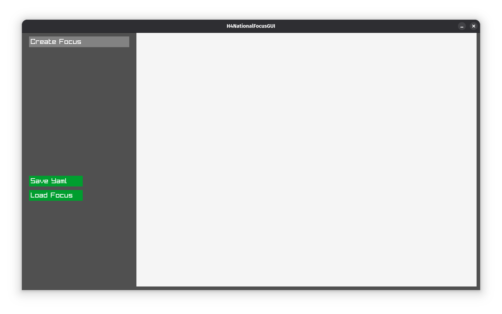

# Hoi4NationalFocusGUI




## Description

A simple program built with Raylib to create national focus trees for the game Hearts of Iron IV.

## Installation From Source

### You Need .NET SDK 9.0 To Build Then

1. **Clone the repository:**

   ```bash
   git clone https://github.com/soulwach900/Hoi4NationalFocusGUI.git
   ```

   ```bash
   cd "Hoi4NationalFocusGUI"
   ```

2. **Build Project:**

   ```bash
   dotnet build
   ```

3. **Running:**

   ```bash
   dotnet run
   ```

## External Dependencies

This project uses [texconv.exe](https://github.com/microsoft/DirectXTex) from the Microsoft DirectXTex library to convert PNG images to DDS format.

### Download texconv.exe

Please download the latest version of `texconv.exe` from the official releases page:

[https://github.com/microsoft/DirectXTex/releases/latest/download/texconv.exe](https://github.com/microsoft/DirectXTex/releases/latest/download/texconv.exe)

After downloading, place the executable in the `thirdparty/texconv` directory in the project.

## Third-Party Licenses

[Microsoft Corporation](thirdparty/texconv/LICENSE.txt)